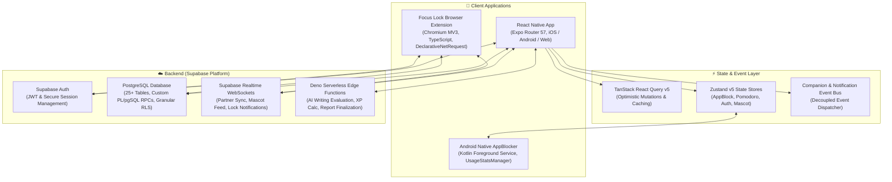

# 🐱 Kitty & Star — StudyPartner

> **A cross-platform, gamified dual-accountability study ecosystem and cross-device focus enforcement engine built with React Native (Expo 57), TypeScript, Supabase Realtime, Native Android Services, and Chromium Manifest V3.**

[](https://reactnative.dev/)
[](https://expo.dev/)
[](https://www.typescriptlang.org/)
[](https://supabase.com/)
[](https://nativewind.dev/)
[](https://tanstack.com/query)
[](https://developer.chrome.com/docs/extensions/)
[](https://kotlinlang.org/)

---

## 📑 Table of Contents

- [Overview](#-overview)
- [System Architecture](#-system-architecture)
- [Core Feature Ecosystem](#-core-feature-ecosystem)
  - [1. Dual-User Peer Accountability Engine](#1-dual-user-peer-accountability-engine)
  - [2. Multi-Platform Focus Lock & Distraction Blocker](#2-multi-platform-focus-lock--distraction-blocker)
  - [3. Interactive Companion & Emotional Mascot](#3-interactive-companion--emotional-mascot)
  - [4. Spaced Repetition (SM-2) & Learning Suite](#4-spaced-repetition-sm-2--learning-suite)
  - [5. AI Writing Evaluation & Grammar Engine](#5-ai-writing-evaluation--grammar-engine)
  - [6. Urge Control & Dopamine Detox](#6-urge-control--dopamine-detox)
  - [7. PYQ Mock Exam & Testing Platform](#7-pyq-mock-exam--testing-platform)
  - [8. Gamification, XP Engine & Duolingo-Style Journey](#8-gamification-xp-engine--duolingo-style-journey)
  - [9. Smart Pomodoro & Hydration Systems](#9-smart-pomodoro--hydration-systems)
- [Technology Stack](#-technology-stack)
- [Project Directory Structure](#-project-directory-structure)
- [Database Schema & Security Architecture](#-database-schema--security-architecture)
- [Getting Started & Local Setup](#-getting-started--local-setup)
- [📄 Resume & Portfolio Highlights](#-resume--portfolio-highlights-ready-to-scrape)
- [License](#-license)

---

## 🌟 Overview

**Kitty & Star (StudyPartner)** is a comprehensive productivity and educational platform engineered to eliminate procrastination, bridge digital accountability gaps, and maximize study efficiency.

Traditional study apps rely on isolated self-discipline; **Kitty & Star** pairs two study partners in a synchronized, mutual-verification loop. Users lock in daily morning commitments, submit verifiable photographic proof of completed tasks, and review each other’s submissions before daily streaks and XP are awarded.

To enforce deep focus during study sessions, the platform integrates a **multi-platform distraction blocking system**:

1. **Android Native Service**: A custom Kotlin foreground service tracking `UsageStats` that intercepts and redirects banned apps during Pomodoro sessions.
2. **Chromium Extension (Manifest V3)**: An event-driven browser extension utilizing the `declarativeNetRequest` API and real-time WebSockets to synchronize focus sessions between mobile and desktop browsers, blocking distracting websites and algorithmic short-form video feeds.

---

## 🏗️ System Architecture



---

## 🚀 Core Feature Ecosystem

### 1. Dual-User Peer Accountability Engine

- **Cryptographic Invite Pairing**: 1-on-1 private partner linking via unique alphanumeric invite tokens (`partner_invites`).
- **Daily Plan Locking**: Users draft morning task lists with estimated durations. Once confirmed, plans lock to prevent retroactive tampering.
- **Proof-Backed Task Completion**: Tasks require photo evidence upload (direct camera capture or gallery picker) with optional per-task notes and captions.
- **Mutual Review & Approval Workflow**: The paired partner inspects submitted photographic evidence, approving or rejecting the day's study log with structured feedback.
- **Streak Protection & Freeze Mechanics**: Daily streak counters update only upon mutual review approval, with support for streak freeze items.

### 2. Multi-Platform Focus Lock & Distraction Blocker

- **Android Native App Blocker**:
  - Engineered in **Kotlin** (`AppBlockingService.kt`, `AppBlockerModule.kt`) utilizing Android's `UsageStatsManager` and `PACKAGE_USAGE_STATS`.
  - Runs as an active **Foreground Service** (`specialUse` FGS type) checking foreground tasks every 1,000ms.
  - Automatically redirects users back to the study app with `Intent.FLAG_ACTIVITY_REORDER_TO_FRONT` when blacklisted apps (social media, games) are launched during active Pomodoros.
  - Injected seamlessly into Expo managed builds via a custom Expo Config Plugin (`withAppBlockingService.js`).
- **Chromium Browser Extension (Manifest V3)**:
  - Decoupled TypeScript architecture featuring a clean `BrowserAdapter` abstraction to support Chrome, Edge, and Brave.
  - Leverages Chromium’s high-performance `declarativeNetRequest` rulesets to block distraction domains at the network level without overhead.
  - Injected content script targeting YouTube to selectively block addictive short-form video feeds (`/shorts/`) while permitting educational long-form videos.
  - Real-time bidirectional WebSocket synchronization via Supabase Realtime: starting a Pomodoro on mobile immediately triggers desktop browser blocking.

### 3. Interactive Companion & Emotional Mascot

- **Dynamic Mascot (Kitty & Star)**: An interactive study buddy with stateful emotion modeling responding to real-time events (`CompanionBus`).
- **Emotion Engine**: Computes companion mood and animation cycles (Happy, Focused, Sleepy, Proud, Cheerful, Strict) based on study streaks, session durations, and partner actions.
- **Live Bulletin Stage**: An in-app newsfeed displaying real-time announcements, partner milestones, and motivational affirmations.
- **Customization & Personality Modes**:
  - _Skins_: Classic Kitty, Golden Kitty, Space Explorer, Cyber Cat.
  - _Personality Modes_: Cheerful Buddy, Strict Coach, Zen Master, Playful Buddy.

### 4. Spaced Repetition (SM-2) & Learning Suite

- **SuperMemo SM-2 Algorithmic Engine**:
  - Implements the mathematical SM-2 Spaced Repetition Algorithm to calculate optimal review intervals, repetition counts, and Easiness Factors ($EF$).
  - PostgreSQL stored procedures automate the review scheduling pipeline based on user quality ratings ($q \in [0, 5]$).
- **Custom Flashcard Collections**: Create, organize, edit, and export decks with tagging and mastery tracking.

### 5. AI Writing Evaluation & Grammar Engine

- **Gemini-Powered Essay & Writing Evaluator**:
  - Supabase Deno Edge Function (`evaluate-writing`) integrates Google Gemini AI models to analyze submitted paragraphs and essays.
  - Generates detailed rubrics covering grammar accuracy, vocabulary richness, coherence, and actionable rewrite recommendations.
- **Interactive Grammar Practice**: Categorized quizzes with instant score calculation, step-by-step grammatical explanations, and error review.
- **Curated Daily Vocabulary**: Daily word drops with definitions, phonetic transcriptions, parts of speech, synonyms, and contextual usage examples.

### 6. Urge Control & Dopamine Detox

- **Impulse Interruption Mechanism**: Designed to derail procrastination urges and doomscrolling impulses.
- **Randomized Micro-Action Engine**: Gamified 3D-animated dice roller picking scientifically grounded 2-to-15 minute reset exercises (breathing exercises, posture correction, quick journaling).
- **Embedded Countdown Timers**: Focus timers keep users accountable during impulse redirection.
- **Cognitive Reframing**: Curated behavioral psychology quotes dynamically rendered per session.

### 7. PYQ Mock Exam & Testing Platform

- **Timed Exam Simulations**: Subject-wise Previous Year Questions (PYQ) testing environment simulating real exam conditions.
- **Automated Grading & Review**: Calculates accuracy percentages, subject mastery breakdowns, and historical score progression.
- **Realtime Attempt Sync**: Instant backend sync with live attempt restoration in case of unexpected app closure.

### 8. Gamification, XP Engine & Duolingo-Style Journey

- **XP Rules Engine**: Stored procedure `calculate-xp` awards granular experience points for completed tasks, approved daily plans, flashcard sessions, and study streaks.
- **Duolingo-Inspired XP Journey**: Visual milestone roadmap (`journey.service.ts`) where users unlock milestone nodes and rewards.
- **Partner Challenge Contracts**: Partners can attach custom challenges and real-life rewards (e.g., "Treat for Coffee") to specific XP milestones.
- **Achievement & Badging System**: 20+ automated badges (e.g., _Early Bird_, _Focus Master_, _Century Club_) unlocked via trigger-based database functions.

### 9. Smart Pomodoro & Hydration Systems

- **Smart Pomodoro Timer**: Configurable work/break intervals (25/5, 50/10, custom), ambient background keep-awake (`expo-keep-awake`), and local notifications (`expo-notifications`).
- **Hydration Tracker**: Daily fluid intake logger with target progress rings, intake logs, and hydration streak awards.

---

## 💻 Technology Stack

| Domain                    | Technology / Library                                           | Purpose                                                            |
| ------------------------- | -------------------------------------------------------------- | ------------------------------------------------------------------ |
| **Mobile Framework**      | React Native 0.86.2, Expo SDK 57                               | Cross-platform mobile development (iOS & Android)                  |
| **Routing**               | Expo Router v57 (File-based routing)                           | Deep linking, nested layouts, protected auth guards                |
| **Language**              | TypeScript ~6.0.3                                              | End-to-end type safety across mobile, web, and backend             |
| **Styling & UI**          | NativeWind v4 (Tailwind CSS 3.4), Lucide React Native          | Utility-first responsive design, modern dark/light glassmorphic UI |
| **Animations**            | React Native Reanimated 4.5, React Native Gesture Handler      | 60 FPS fluid gesture interactions and mascot animations            |
| **State Management**      | Zustand v5                                                     | Lightweight, modular global state stores with persistence          |
| **Data Fetching & Cache** | TanStack React Query v5                                        | Server state caching, optimistic updates, background polling       |
| **Forms & Validation**    | React Hook Form, Zod v4                                        | Schema validation and high-performance form control                |
| **Backend & DB**          | Supabase (PostgreSQL 15), Supabase Realtime                    | Auth, Row-Level Security (RLS), real-time WebSockets, RPCs         |
| **Serverless Functions**  | Supabase Edge Functions (Deno / TypeScript)                    | AI evaluations, XP calculation, report finalization                |
| **Native Android**        | Kotlin, Android SDK (`UsageStatsManager`, `ForegroundService`) | System-level distraction app interception and redirection          |
| **Browser Extension**     | Chromium Manifest V3, Webpack / Babel, DeclarativeNetRequest   | Cross-device desktop website and YouTube Shorts blocker            |
| **Notifications**         | Expo Notifications, Android Priority Channels                  | Scheduled alarms, push alerts, and timer triggers                  |

---

## 📁 Project Directory Structure

```text
kitty-and-the-star/
├── android/                        # Android native project files
│   └── app/src/main/java/com/studypartner/app/
│       ├── AppBlockerModule.kt     # React Native JSI bridge for app blocking
│       ├── AppBlockerPackage.kt    # Native package registrar
│       └── AppBlockingService.kt   # Android Kotlin Foreground Service
├── app/                            # Expo Router file-based route tree
│   ├── _layout.tsx                 # Root layout & query client provider
│   ├── (auth)/                     # Authentication routes (Login, Signup, Partner Linking)
│   │   ├── login.tsx
│   │   ├── signup.tsx
│   │   └── partner-linking.tsx
│   └── (app)/                      # Authenticated core application screens
│       ├── home.tsx                # Central hub & companion stage
│       ├── pomodoro.tsx            # Pomodoro timer & distraction control
│       ├── planner.tsx             # Daily task planner & scheduler
│       ├── accountability/         # Daily submission, verification & reports
│       │   ├── submit.tsx          # Proof image uploader & task checklist
│       │   ├── review.tsx          # Partner submission verification screen
│       │   └── reports.tsx         # Historical report archives
│       ├── english.tsx             # English suite (Vocab, Grammar, AI Writing)
│       ├── flashcards.tsx          # SM-2 Spaced Repetition decks
│       ├── pyq.tsx                 # Previous Year Question mock test engine
│       ├── urge-control.tsx        # Dopamine detox & micro-habit roller
│       ├── journey.tsx             # Duolingo-style XP roadmap
│       ├── achievements.tsx        # Badges and trophy room
│       ├── statistics.tsx          # Detailed progress analytics
│       └── water.tsx               # Hydration tracker
├── components/                     # Reusable UI & modular components
│   ├── ui/                         # Design system primitives (Button, Card, Screen, Input)
│   ├── english/                    # Specialized English learning sub-components
│   └── growth-stats-animated-card.tsx
├── extensions/
│   └── focus-lock-extension/       # Chromium Manifest V3 browser extension
│       ├── manifest.json
│       ├── background/             # Service worker lifecycle coordinator
│       ├── blocking/               # DeclarativeNetRequest rules & browser adapter
│       ├── content/                # Content scripts (YouTube Shorts interceptor)
│       └── ui/                     # Extension popup interface
├── features/                       # Domain-driven feature modules & logic
│   ├── accountability/             # Todo lists, modals, proof viewer
│   ├── companion/                  # Mascot state engine, animation scheduler, bulletin
│   ├── notifications/              # Intelligent notification generator & event bus
│   ├── activity/                   # Zod schemas for activity tracking
│   └── auth/                       # Auth validation schemas & avatar helpers
├── services/                       # API and Supabase service layer
│   ├── backend.ts                  # Core backend RPC calls & subscriptions
│   ├── flashcard.service.ts        # SM-2 database mutations
│   ├── journey.service.ts          # XP Journey & milestone challenge APIs
│   ├── mascot.service.ts           # Companion feed & event dispatcher
│   ├── statistics.service.ts       # Analytical aggregation services
│   └── writing.service.ts          # AI writing evaluation dispatcher
├── stores/                         # Zustand global state slices
│   ├── auth-store.ts               # User profile, session, partner state
│   ├── pomodoro-store.ts           # Timer state, intervals, active sessions
│   ├── app-block-store.ts          # Blocked package lists & blocking toggle
│   ├── chrome-blocker-store.ts     # Extension sync state
│   ├── english-store.ts            # Daily vocabulary & quiz state
│   └── companion-queue-store.ts    # Mascot notification queue
├── supabase/                       # Backend database configuration
│   ├── migrations/                 # 20+ SQL migration scripts (Tables, RLS, RPCs)
│   └── functions/                  # Deno Edge Functions (evaluate-writing, calculate-xp)
├── theme/                          # Design tokens, color palettes, typography
├── types/                          # TypeScript types & generated database definitions
└── withAppBlockingService.js       # Expo Config Plugin for Android Foreground Service
```

---

## 🔒 Database Schema & Security Architecture

The backend is built on **Supabase PostgreSQL** with strict data isolation enforced via **Row-Level Security (RLS)**:

- **Row-Level Security Policies**: Users can only modify their own plans, tasks, and attempts. Connected study partners are granted read-only access to their partner's daily plans, proof submissions, and statistics via bidirectional `partner_id` verification policies.
- **Transactional Consistency**: Key workflows (e.g., `create_draft`, `duplicate_draft_into_daily_plans`, `finish_pyq_attempt`, `approve_submission`) are executed via atomic **PostgreSQL Stored Procedures (RPCs)** to guarantee idempotency and eliminate race conditions.
- **Realtime Change Data Capture (CDC)**: Supabase Realtime listens to PostgreSQL write-ahead logs (`WAL`), broadcasting changes on `notifications`, `daily_reports`, and `user_settings` directly to mobile clients and browser extensions.

---

## 🛠️ Getting Started & Local Setup

### Prerequisites

- **Node.js**: `v20.x` or higher
- **npm** or **yarn**
- **Android Studio** (for Android native builds / emulator testing)
- **Supabase CLI** (optional, for local Edge Function testing)

### 1. Clone & Install Dependencies

```bash
git clone https://github.com/allwin23/Kitty---star.git
cd Kitty---star
npm install
```

### 2. Configure Environment Variables

Create a `.env` file in the root directory:

```env
EXPO_PUBLIC_SUPABASE_URL=https://your-project-ref.supabase.co
EXPO_PUBLIC_SUPABASE_ANON_KEY=your-supabase-anon-key
```

### 3. Start the Development Server

```bash
# Generate asset maps and start Expo bundler
npm start

# Run on Android device / emulator
npm run android

# Run on iOS simulator (macOS required)
npm run ios

# Run web preview
npm run web
```

### 4. Build & Install Chrome Extension

```bash
cd extensions/focus-lock-extension
npm install
npm run build
```

1. Open Google Chrome and navigate to `chrome://extensions/`.
2. Enable **Developer mode** (top right toggle).
3. Click **Load unpacked** and select `extensions/focus-lock-extension/dist`.

---

## 📄 Resume & Portfolio Highlights (Ready to Scrape)

> _The following structured bullet points and metrics are formatted for direct inclusion in software engineering resumes, LinkedIn project sections, and technical portfolios._

### 🎯 Role: Full-Stack Mobile & Systems Engineer

```markdown
**Kitty & Star — Gamified Study Accountability & Cross-Device Focus Platform**
_React Native (Expo 57), TypeScript, Supabase, PostgreSQL, Kotlin, Chrome MV3, TanStack Query, Zustand_

• Architected and developed a full-stack, cross-platform study accountability application supporting iOS, Android, and Web using React Native (Expo 57), React 19, and TypeScript, featuring a dual-user verification loop and gamified mascot companion.
• Engineered a multi-platform distraction blocking system integrating a native Android Kotlin Foreground Service (UsageStatsManager) and a Chromium Manifest V3 browser extension (DeclarativeNetRequest API) synchronized in real-time via Supabase WebSockets.
• Implemented the SuperMemo SM-2 Spaced Repetition Algorithm within PostgreSQL stored procedures to dynamically calculate flashcard review intervals, repetition curves, and ease factors.
• Built a real-time event-driven companion mascot engine with an emotion state machine, animation scheduler, and live bulletin board broadcasting partner progress and milestones.
• Integrated Google Gemini AI models via Supabase Edge Functions (Deno/TypeScript) to provide automated essay evaluations, grammatical corrections, and stylistic feedback.
• Designed a secure relational database schema on Supabase PostgreSQL comprising 25+ tables, atomic PL/pgSQL RPCs, and granular Row-Level Security (RLS) policies enforcing zero-trust partner data access.
• Created a custom Expo Config Plugin (withAppBlockingService.js) to inject Android Foreground Service permissions (PACKAGE_USAGE_STATS, SYSTEM_ALERT_WINDOW) into prebuilds without ejecting from Expo managed workflow.
• Optimized frontend performance and offline resilience using TanStack React Query v5 for optimistic cache updates and Zustand v5 for persisted state slices, achieving 60 FPS fluid gesture animations via Reanimated 4.
```

---

### 💼 Alternative Compact Bullet Points (By Category)

#### 📱 Mobile & Frontend Engineering

- Built a cross-platform mobile app using **React Native 0.86**, **Expo SDK 57**, and **Expo Router**, implementing nested tab/stack navigation, auth guards, and glassmorphic UI design tokens with **NativeWind (Tailwind CSS)**.
- Leveraged **TanStack React Query v5** for optimistic server cache invalidation and **Zustand v5** for offline-first global state management.
- Delivered 60 FPS interactive animations for companion mascots, gamified dice rollers, and XP progress rings using **React Native Reanimated 4** and **Gesture Handler**.

#### ⚙️ Systems & Native Development

- Developed a native **Android Foreground Service in Kotlin** that monitors `UsageStats` every second and intercepts blacklisted applications with immediate overlay redirection during focus mode.
- Created an **Expo Config Plugin** to configure custom Android manifests, background service types (`specialUse`), and system permissions within continuous integration pipelines.
- Built a decoupled **Chromium Manifest V3 browser extension** using TypeScript and the `declarativeNetRequest` API, achieving network-level website blocking and YouTube Shorts filtering.

#### ☁️ Backend & Cloud Architecture

- Designed a scalable **Supabase PostgreSQL** database with 25+ normalized tables, triggers, and complex PL/pgSQL stored procedures ensuring ACID compliance across daily plan lifecycle states.
- Implemented robust **Row-Level Security (RLS)** policies enabling secure mutual data visibility between paired accountability partners while preventing unauthorized multi-tenant access.
- Deployed serverless **Deno Edge Functions** integrating LLM APIs (Gemini) for natural language writing assessments and automated daily report finalizations.

---

## 📜 License

This project is licensed under the [MIT License](LICENSE) — see the LICENSE file for details.

---

<div align="center">
  <sub>Built with ❤️ for focused learners everywhere. Designed and developed by <a href="https://github.com/allwin23">Allwin</a>.</sub>
</div>
